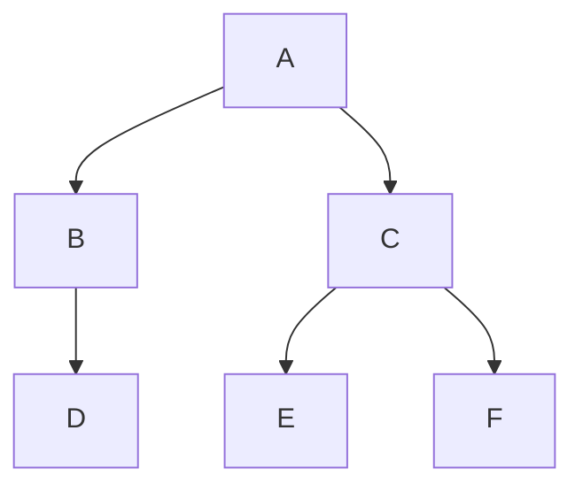

# Práctica 11: rutas en un árbol binario

Programa independiente de terminal que explora un árbol binario desde A hasta F.
Usa únicamente la biblioteca estándar de Python 3.10 o posterior.

## Estructura del árbol

Se interpreta la consigna así: A es la raíz; B y D forman la rama izquierda,
y C, E y F forman la rama derecha. D es hijo izquierdo de B; E y F son los hijos
izquierdo y derecho de C, respectivamente.



Cada nodo tiene como máximo dos hijos. D, E y F son hojas: no tienen hijos.
No se añaden conexiones entre ramas.

## Resultado en terminal

```text
Todas las rutas desde A hasta una hoja:
1. A -> B -> D
2. A -> C -> E
3. A -> C -> F
Total de rutas: 3

Rutas desde A hasta F:
1. A -> C -> F
Total de rutas: 1
```

En un árbol hay una única ruta simple entre dos nodos. Por eso las tres rutas
listadas terminan en hojas diferentes y solamente A → C → F llega a F.

## Ejecutar en VS Code con WSL

```bash
cd ~/universidad/fundamentos-ia &&
git pull --ff-only origin main &&
bash unidad-01-introduccion-ia/practicas/practica-11-arbol-binario/ejecutar.sh
```

El lanzador usa el intérprete `.venv/bin/python` del proyecto si existe; en otro
caso utiliza `python3`. También puedes ejecutar directamente:

```bash
python3 unidad-01-introduccion-ia/practicas/practica-11-arbol-binario/11_arbol_binario.py
```

## Cómo funciona

- `Nodo` representa un valor y sus dos hijos posibles. `dataclass` evita repetir
  el constructor de esta estructura.
- `construir_arbol()` define las conexiones indicadas arriba.
- `buscar_rutas()` usa búsqueda en profundidad (DFS): visita primero la izquierda
  y luego la derecha, conservando una copia del camino para cada rama.
- Con destino `'F'` obtiene las rutas que llegan a F. Sin destino obtiene todas
  las rutas desde la raíz hasta las hojas.
- `main()` muestra ambos resultados sin solicitar datos adicionales.

Se verificaron las tres rutas a hojas, la ruta a F, la búsqueda de la raíz, un
destino inexistente, el árbol vacío y que búsquedas repetidas no alteren el árbol.
