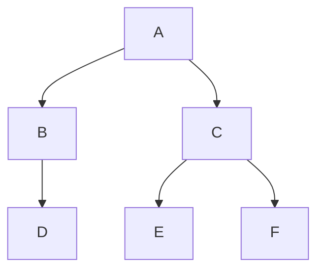

# Práctica 11: rutas en un árbol binario

Programa independiente con una interfaz sencilla de **Tkinter** que explora un
árbol binario desde A hasta F. Conserva la salida en terminal y la misma búsqueda
en profundidad (DFS). Usa Python 3.10 o posterior; no necesita paquetes de pip.

## Estructura del árbol

Se interpreta la consigna así: A es la raíz; B y D forman la rama izquierda,
y C, E y F forman la rama derecha. D es hijo izquierdo de B; E y F son los hijos
izquierdo y derecho de C, respectivamente.



Cada nodo tiene como máximo dos hijos. D, E y F son hojas: no tienen hijos.
No se añaden conexiones entre ramas.

## Interfaz gráfica

Al ejecutar el programa aparece una ventana con el árbol y sus tres rutas a hojas.

- **Buscar A → F:** muestra la única ruta hasta F y resalta en verde los nodos
  A, C y F y las conexiones de ese camino.
- **Ver todas las rutas:** muestra de nuevo los tres caminos a las hojas D, E y F,
  su cantidad y el árbol sin resaltar.

La ventana se puede redimensionar y el dibujo se ajusta al espacio disponible.
No se modifican nodos ni conexiones. Los resultados se calculan con la misma
función `buscar_rutas()` que utiliza la terminal.

## Resultado en terminal

```text
Todas las rutas desde A hasta una hoja:
1. A -> B -> D
2. A -> C -> E
3. A -> C -> F
Total de rutas: 3

Rutas desde A hasta F:
1. A -> C -> F
Total de rutas: 1
```

En un árbol hay una única ruta simple entre dos nodos. Por eso las tres rutas
listadas terminan en hojas diferentes y solamente A → C → F llega a F.

## Ejecutar en VS Code con WSL

La ventana requiere Tkinter y una sesión gráfica (WSLg en WSL). Si ya usas
Tkinter en las prácticas 9 o 10, puedes utilizar el mismo entorno. Si falta
Tkinter, instálalo en Ubuntu/WSL:

```bash
sudo apt install -y python3-tk
```

Después, descarga la actualización y abre la ventana:

```bash
cd ~/universidad/fundamentos-ia &&
git pull --ff-only origin main &&
bash unidad-01-introduccion-ia/practicas/practica-11-arbol-binario/ejecutar.sh
```

El lanzador usa el intérprete `.venv/bin/python` del proyecto si existe; en otro
caso utiliza `python3`. También puedes ejecutar directamente:

```bash
python3 unidad-01-introduccion-ia/practicas/practica-11-arbol-binario/11_arbol_binario.py
```

Los resultados también se imprimen en la terminal al abrir la ventana. Para
mostrar únicamente la salida de terminal, sin requerir Tkinter ni pantalla:

```bash
bash unidad-01-introduccion-ia/practicas/practica-11-arbol-binario/ejecutar.sh --terminal
```

Si Tkinter no está disponible o no se puede abrir la ventana, el programa muestra
un mensaje en español con la alternativa `--terminal`. Puedes comprobar el soporte
gráfico ejecutando `.venv/bin/python -m tkinter` (o `python3 -m tkinter` si no usas
el entorno virtual).

## Cómo funciona

- `Nodo` representa un valor y sus dos hijos posibles. `dataclass` evita repetir
  el constructor de esta estructura.
- `construir_arbol()` define las conexiones indicadas arriba.
- `buscar_rutas()` usa búsqueda en profundidad (DFS): visita primero la izquierda
  y luego la derecha, conservando una copia del camino para cada rama.
- Con destino `'F'` obtiene las rutas que llegan a F. Sin destino obtiene todas
  las rutas desde la raíz hasta las hojas.
- `abrir_interfaz()` dibuja el árbol en un `Canvas` y conecta los dos botones con
  la búsqueda existente; el color verde identifica la ruta seleccionada.
- `main()` muestra ambos resultados y abre Tkinter, salvo que se indique `--terminal`.

## Verificación

Se conserva la búsqueda original, ya verificada con las tres rutas a hojas, la
ruta a F, la búsqueda de la raíz, un destino inexistente y el árbol vacío.
La actualización se comprueba con el lanzador en modo `--terminal`, la sintaxis
y el mensaje para una sesión sin pantalla. Este entorno no dispone de pantalla
gráfica; queda pendiente comprobar visualmente la ventana en WSLg.

Referencia: [documentación oficial de Tkinter](https://docs.python.org/3/library/tkinter.html).
