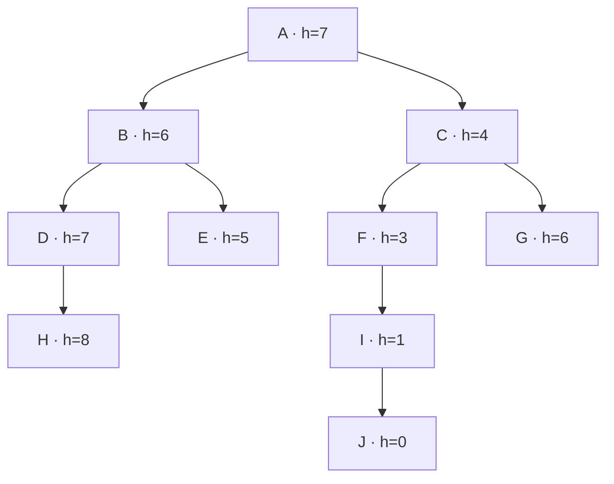

# Práctica 15 · Heurísticas y búsqueda A*

**Objetivo:** encontrar un camino desde **A hasta J**, eligiendo de la frontera
el estado con menor estimación del costo total: **f(n) = g(n) + h(n)**.

| Valor | Qué representa | Cómo se obtiene |
| --- | --- | --- |
| g(n) | Costo ya recorrido desde A | Suma de los pesos de las aristas recorridas |
| h(n) | Estimación de lo que falta hasta J | Valor proporcionado en el ejercicio |
| f(n) | Estimación del costo total pasando por n | g(n) + h(n) |

Por ejemplo, al llegar a C con los costos iniciales: **g(C)=1**, **h(C)=4**,
**f(C)=5**. Al llegar a J, **h(J)=0**, así que f(J) coincide con el costo recorrido.
Los valores `A7, B6, ...` corresponden a **h**, no a los costos de las aristas.

## Grafo de la imagen de esta práctica

Se interpretan las conexiones de padre a hijo como aristas dirigidas:



**La imagen no indica pesos.** Por eso se adopta un costo inicial de **1 por
movimiento**, que puede cambiarse en la ventana. No se trasladan los pesos de
la práctica 14: esta imagen tiene conexiones diferentes, en particular F → I → J.

| Nodo | A | B | C | D | E | F | G | H | I | J |
| --- | --- | --- | --- | --- | --- | --- | --- | --- | --- | --- |
| h(n) original | 7 | 6 | 4 | 7 | 5 | 3 | 6 | 8 | 1 | 0 |

## Ejecutar en VS Code con WSL

Requiere **Python 3.10 o posterior**. Utiliza solo la biblioteca estándar;
no necesita instalar paquetes con pip, MongoDB ni Ollama.

Desde la raíz de `fundamentos-ia`:

```bash
bash unidad-01-introduccion-ia/practicas/practica-15-busqueda-a-estrella/ejecutar.sh
```

El lanzador utiliza `.venv/bin/python` si existe; de lo contrario, `python3`.
También puedes ejecutar directamente el archivo `15_busqueda_a_estrella.py`
desde VS Code con el intérprete de tu proyecto.

Si falta Tkinter en Ubuntu/WSL, instala el paquete correspondiente a tu Python:

```bash
sudo apt install python3-tk
```

La ventana necesita soporte gráfico WSLg. Para trabajar sin ventana:

```bash
bash unidad-01-introduccion-ia/practicas/practica-15-busqueda-a-estrella/ejecutar.sh --terminal
```

## Uso de la interfaz

1. Pulsa **Calcular A → J**. El primer paso extrae A y genera B y C.
2. Observa el estado actual y sus indicadores **g, h, f y profundidad**.
3. Usa **Paso siguiente**, **Animar/Pausar** o **Ver resultado** para avanzar.
4. Revisa **Frontera** para ver los caminos pendientes ordenados por f y
   **Pasos** para consultar las extracciones realizadas.
5. En **Heurísticas**, compara h(n) con el costo real restante del grafo.
6. En **Editar costos y h(n)** cambia los pesos o estimaciones y pulsa **Aplicar**.
   La búsqueda se reinicia; las ediciones solo duran durante esa sesión.

**Cargar originales** rellena el editor con costos unitarios y las estimaciones
del profesor; pulsa Aplicar para confirmarlos. Cancelar descarta las ediciones.
Reiniciar limpia el recorrido y conserva los valores aplicados.

Los campos aceptan cero y decimales con punto o coma. Rechazan campos vacíos,
texto, negativos, NaN, infinitos y sumas que desborden. **h(J) permanece en 0**.
El grafo señala el camino en verde y el nodo extraído en ámbar; cada nodo
muestra h y cada arista muestra su costo.

## Resultado con los valores originales

| Paso | Nodo extraído | g(n) | h(n) | f(n) | Frontera después del paso, por f |
| --- | --- | --- | --- | --- | --- |
| 1 | A | 0 | 7 | 7 | C:5, B:7 |
| 2 | C | 1 | 4 | 5 | F:5, B:7, G:8 |
| 3 | F | 2 | 3 | 5 | I:4, B:7, G:8 |
| 4 | I | 3 | 1 | 4 | J:4, B:7, G:8 |
| 5 | J | 4 | 0 | 4 | B:7, G:8 |

- Ruta encontrada: **A → C → F → I → J**.
- Costo recorrido: **4**; profundidad de la solución: **4 aristas**.
- Orden de extracción: A, C, F, I, J. Coincide con la ruta en este ejemplo,
  pero en otros grafos pueden explorarse estados que no integren la solución.
- B y G quedan pendientes cuando se alcanza J. A* no necesita visitar todo el árbol.

## Qué indican las estimaciones del ejercicio

Se conservan exactamente las h indicadas. Con pesos unitarios, el costo real
restante desde A es 4, desde C es 3 y desde F es 2. Sus estimaciones **7, 4 y 3
sobreestiman** esos costos: esta heurística no es admisible para esos pesos.

En este árbol solo existe una ruta dirigida de A a J; el programa la encuentra.
En un grafo con alternativas, una h que sobreestima puede hacer que A* termine
en una ruta más cara. Por eso la interfaz indica **ruta encontrada** y **costo
recorrido**, y no promete siempre una solución óptima con cualquier h.

La consistencia exige `h(u) ≤ costo(u,v) + h(v)` en cada arista. Los valores
originales incumplen esa condición en A → C y F → I; esto explica que los valores
f extraídos puedan bajar: **7, 5, 5, 4, 4**. No es un error de la cola.

La pestaña Heurísticas calcula costos reales solo para la explicación didáctica,
mediante Dijkstra sobre el grafo invertido. **A* no usa esos costos para ordenar
la frontera ni reemplaza las h del usuario.** Los nodos sin camino dirigido a J
se muestran como «Sin ruta». Al cambiar costos o h, se actualiza la revisión.

## Funcionamiento del código

1. Valida el grafo, las estimaciones, inicio y objetivo.
2. Inserta A en un `heapq` con g=0 y f=h(A).
3. Extrae la entrada de menor f. Un contador desempata por orden de llegada.
4. Comprueba si el estado extraído es la meta.
5. Para cada vecino calcula `nuevo_g = g_actual + costo_arista` y
   `nuevo_f = nuevo_g + h_vecino`.
6. Si mejora el g conocido de ese vecino, guarda la ruta y la inserta en el heap.
7. Reabre un estado ya explorado si se descubre un g menor; descarta entradas
   antiguas y evita ciclos de costo cero usando mejoras estrictas.

La meta se comprueba **al extraer**, no al descubrirla. La reapertura permite
tratar heurísticas admisibles pero inconsistentes; con h admisible y h(meta)=0,
el algoritmo conserva la garantía de costo mínimo. Si h es cero en todos los
estados, A* se comporta como búsqueda de costo uniforme.

La tabla ordena una copia de las entradas vigentes para que sea legible. La
estructura utilizada por la búsqueda sigue siendo un heap, no una lista
completamente ordenada. Cada paso conserva una instantánea del camino y la frontera.

| Archivo | Responsabilidad |
| --- | --- |
| `busqueda_a_estrella.py` | Grafo, h, validación, algoritmo A* y revisión didáctica |
| `15_busqueda_a_estrella.py` | Interfaz Tkinter, animación, editor y modo terminal |
| `ejecutar.sh` | Elegir el intérprete e iniciar la práctica desde WSL |
| `test_a_estrella.py` | Pruebas de rutas, prioridades, reapertura y entradas |

Cada archivo permanece en la carpeta de la práctica 15. No importa código de
otras prácticas ni cambia la práctica 14.

## Verificación

Desde la raíz del proyecto:

```bash
python3 -m unittest discover -s unidad-01-introduccion-ia/practicas/practica-15-busqueda-a-estrella -p 'test_*.py' -v
```

Las pruebas cubren el ejercicio original, prioridad por f, detección de la meta
al extraer, reapertura con mejor g, entradas antiguas, empates, ciclos con costo
cero, estados sin ruta, inicio igual a meta, sobreestimaciones y validación.

## Referencias

- [Documentación de Python: heapq y colas de prioridad](https://docs.python.org/3/library/heapq.html).
- [UC Berkeley CS188: búsqueda informada, A* y admisibilidad](https://inst.eecs.berkeley.edu/~cs188/textbook/search/informed.html).

Los datos del grafo y las estimaciones provienen de la imagen y del enunciado
de clase. Los pesos unitarios son un supuesto explícito de esta implementación.
